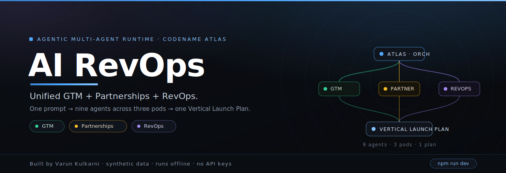

<p align="center">
  
</p>

# AI RevOps — unified GTM + Partnerships + RevOps

    

**Part of the [AI PM Agent Showcase](https://github.com/varunk130/ai-pm-portfolio)** — five standalone agentic apps · App 3 of 5.

> GTM, partnerships, and revenue ops are one system — not three teams throwing docs over a wall. Atlas takes a company into a new market segment end-to-end, and shows its work.

A standalone, production-quality demo of a **real in-app multi-agent runtime** (codename **Atlas**). One prompt drives **nine agents across three pods** — GTM, Partnerships, and RevOps — under a single orchestrator, producing one coherent **Vertical Launch Plan**: prioritized segments, a go-to-market motion, a scored partner shortlist + outreach, a funnel model, a scored-lead table, a banded revenue forecast, and a build-vs-buy RevOps stack. It runs **completely offline**: no API keys, no external LLM calls, nothing to configure.

**Stack:** Next.js 14 (App Router) · TypeScript · Tailwind · framer-motion · recharts · lucide-react · @faker-js/faker (seed only)

The live demo ships **two switchable scenarios** over the same runtime: a fictional fintech, **Northwind**, entering the **consumer brands / DTC** vertical (product-led, partner-amplified), and an enterprise AI-platform vendor, **Contoso**, entering **Financial Services** via an enterprise **field + partner co-sell** motion. Synthetic data only.

---

## Two switchable scenarios

A scenario toggle on the live demo reskins the *entire* motion — dataset, curated content, terminology, and interactive widgets — while the orchestrator and the eight sub-agents stay identical. Each scenario is a self-contained `ScenarioContent` bundle (`content/{consumer,enterprise}.ts`) over its own seeded dataset.

| | **Consumer brands** — Northwind | **Enterprise · Financial Services** — Contoso |
| --- | --- | --- |
| Motion | Product-led, partner-amplified | Enterprise field sales + partner co-sell |
| Dataset | 2,000-lead CRM · 44 partners · 6 DTC sub-segments | 480 accounts · 38 SI / ISV / marketplace partners · 6 FinServ segments |
| Terminology | leads · PQL · MQL → SQL → Won | accounts · propensity · Target → Engaged → Qualified → Proposal → Won |
| Interactive output | scored-lead table + threshold · funnel · forecast | account-propensity table · **Co-sell Mix** allocator · **Pipeline Coverage** planner |
| Top-line deliverable | Vertical Launch Plan | Vertical Launch Plan **+ Executive Brief** |

Switching scenario swaps the snapshot, content, labels, and default threshold, then re-runs the same nine-agent pipeline — the consumer run is byte-identical to the single-scenario original.

---

## What this demonstrates

Atlas shows that an agentic system can run an entire cross-functional motion with **genuine computation, not theater**: segment and partner scoring, the funnel model, the PQL lead score, and the revenue forecast with confidence bands are all real math over a 2,000-lead CRM. The lead score is **predictive** — win rate rises with it — so the PQL threshold acts as a live precision dial that re-scores the lead table **and** re-runs the forecast. The signature **Agent Trace** makes the three-pod orchestration watchable, grouping hand-offs by pod, with a plain-language layer and a technical layer (agent, tool calls, structured results).

It also shows the runtime is **scenario-portable**: the same nine agents drive a second, fully distinct motion — an enterprise financial-services **co-sell** play — where the data, copy, terminology, and widgets all change but the orchestration does not. The enterprise output adds two more interactive widgets (a **Co-sell Mix** allocator and a **Pipeline Coverage** planner) and a board-ready **Executive Brief**.

---

## Run it

```bash
npm install
npm run dev      # http://localhost:3000
```

Open **/demo**, pick a scenario (**Consumer brands** or **Enterprise · Financial Services**), hit **Run guided demo**, then open a pod tab and drag the threshold or the enterprise sliders. To regenerate the datasets:

```bash
npm run seed             # rewrites data/atlas.json (consumer) deterministically
npm run seed:enterprise  # rewrites data/atlas.enterprise.json (enterprise) deterministically
```

Build for production (Vercel-ready, **zero environment variables**):

```bash
npm run build && npm start
```

---

## 60–90s spoken walkthrough script

> "This is **Atlas** — one agentic platform that takes a company into a new market, end to end. The thesis: GTM, partnerships, and RevOps are one system, not three teams. And it runs right here — no API keys.
>
> I'll type the brief: *'We're entering the consumer-brands vertical. Build the GTM, the partner motion, and the revenue model.'* Watch the **Agent Trace** — it's grouped by pod.
>
> **Atlas** sequences three pods. The **GTM pod**: the Segmenter prioritizes sub-segments — apparel and food/CPG lead on market and fit — and the Motion Designer sets a product-led motion and pricing. The **Partnerships pod**: the Partner Scout scores 44 candidates on a real fit model and picks eight tier-A partners; the Outreach Writer drafts the sequence and a joint one-pager. The **RevOps pod**: the Funnel Engineer derives conversions from 2,000 records, the Lead Scorer scores every lead, the Forecaster projects revenue with a confidence band, and the Attribution Analyst recommends a W-shaped model and a build-vs-buy stack.
>
> Atlas assembles it into one **Vertical Launch Plan**. Now the interactive part — open the **RevOps** tab and drag the **PQL threshold**: the lead table re-scores and the revenue forecast re-runs live. Tighten the threshold and win-rate-at-cut climbs while pipeline narrows — a real precision/volume tradeoff.
>
> Nine agents, three pods, one plan — all computed locally. That's Atlas."

> *Toggle to **Enterprise · Financial Services** and the same nine agents run a different motion entirely: **Contoso** taking an AI platform into financial services via partner **co-sell** — accounts and a propensity score instead of leads and PQL, a **Co-sell Mix** allocator, a **Pipeline Coverage** planner, and a board-ready **Executive Brief**.*

---

## Architecture summary

A goal enters the **Orchestrator (Atlas)**, which sequences three pods of typed sub-agents over an observable message bus. Sub-agents call **named skills** that compute over a 2,000-lead CRM and a 44-partner list. The heavy analytical work runs server-side into a **compact snapshot** so the client never loads the raw dataset; the client does light, interactive re-forecasting on the compact scored leads. Two kinds of output, both key-free:

- **Analytical** (segment/partner scoring, funnel model, lead score, forecast) = genuine math in `src/lib/{scoring,forecast}.ts`.
- **Generative** (motion, outreach + one-pager, attribution/stack) = assembled from `content/`, routed through one LLM seam (`src/lib/llm.ts`).

**Scenario system:** each market is a `ScenarioContent` bundle — curated copy + terminology labels + `buildPlanSummary` / `buildExecBrief` — over its own seeded dataset; `src/lib/scenarios.ts` is the client-safe registry and the shared views/agents are label-driven, so one runtime renders both motions with no forks. The **How it works** page also includes a technical, end-to-end architecture diagram (MCP tool servers · MCP Apps · skills · pluggable RAG / web search / dynamic-LLM seams).

```
Brief → Atlas (orchestrator)
   ├─ GTM pod ........... Segmenter · Motion Designer
   ├─ Partnerships pod .. Partner Scout · Outreach Writer
   └─ RevOps pod ........ Funnel Engineer · Lead Scorer · Forecaster · Attribution Analyst
        (skills: lead-score, forecast · over the 2,000-lead CRM + 44 partners)
   → one Vertical Launch Plan
```

### Project structure

| Path | What's there |
| --- | --- |
| `data/seed.ts` → `data/atlas.json` | Deterministic seed: 2,000-lead CRM funnel, 44 partners, 6 segments (kept server-side) |
| `data/seed.enterprise.ts` → `data/atlas.enterprise.json` | Enterprise seed: 480-account FinServ base, 38 SI/ISV/marketplace partners, 6 segments |
| `src/lib/scoring.ts` | lead score (predictive), partner-fit, segment priority, win-probability |
| `src/lib/forecast.ts` | funnel model + banded revenue forecast from scored open pipeline |
| `src/lib/snapshot.ts` | SERVER-ONLY: builds the compact per-scenario snapshot passed to the client |
| `src/lib/scenarios.ts` | Client-safe scenario registry (labels, content bundle, prompts) |
| `src/skills/` | `lead-score`, `forecast` — reusable, invoked by name |
| `src/agents/` | `orchestrator` (Atlas) + eight typed sub-agent modules + trace types (scenario-aware via `ctx.content`) |
| `content/` | Curated motion, outreach + one-pager, attribution/stack, narration |
| `content/{consumer,enterprise,index}.ts` | Per-scenario bundles + registry: copy, labels, plan summary, exec brief |
| `src/components/TechArchitecture.tsx` | End-to-end technical stack diagram (MCP, skills, pluggable seams) |
| `src/components/demo/` | Agent Trace (pod-grouped), pod tabs, segments/motion/partner/outreach/funnel/lead-table/forecast/attribution views |
| `src/components/demo/{CoSellMix,PipelineCoverage,ExecBrief}.tsx` | Enterprise-only interactive widgets + the executive brief |
| `src/app/` | Home · Problem→Solution · How it works · Live demo · Results |

---

## Agents & skills

### Agents (9)
| Pod | Agent | What it does |
| --- | --- | --- |
| Orchestrator | **Atlas** | Sequences the three pods and assembles the unified plan. |
| GTM | **Segmenter** | Prioritizes the vertical's sub-segments by market × fit × accessibility (real scoring). |
| GTM | **Motion Designer** | Picks channels, sales motion, and a pricing hypothesis. |
| Partnerships | **Partner Scout** | Scores the candidate partners on a real fit model and picks the top tier. |
| Partnerships | **Outreach Writer** | Drafts the partner outreach sequence and a joint-GTM one-pager. |
| RevOps | **Funnel Engineer** | Builds the funnel model — conversions and velocity from the CRM. |
| RevOps | **Lead Scorer** | Applies the PQL scoring model and ranks every lead. |
| RevOps | **Forecaster** | Projects pipeline and revenue with confidence bands. |
| RevOps | **Attribution Analyst** | Proposes a multi-touch model and a build-vs-buy RevOps stack. |

### Skills (reusable, invoked by name)
| Skill | One-liner |
| --- | --- |
| `lead-score` | Turns observable lead features into a 0–100 score + win probability. Used by the Lead Scorer and the interactive table. |
| `forecast` | Funnel → revenue projector: expected bookings with confidence bands from the scored open pipeline at a PQL threshold. |

---

## The interactive math (real, and threshold-driven)

The lead score is a weighted blend of firmographic fit, product-usage signals, engagement, and intent — and it is **predictive**: in the synthetic CRM, win rate rises from ~12% to ~36% across score bands. The PQL threshold slider re-classifies leads (PQL = score ≥ threshold) and re-runs the forecast, which sums `win-probability × ACV` over open PQLs with a ±1 SD band from win-probability variance. Tighten the threshold and win-rate-at-cut rises while pipeline narrows — a genuine precision/volume tradeoff.

**Enterprise widgets** add two more live computations on the same forecast. The **Co-sell Mix** allocator blends a field / partner-co-sell / marketplace split into a weighted CAC, a reach index, and a partner-influenced bookings uplift. The **Pipeline Coverage** planner turns a bookings target into a required-pipeline (target ÷ effective win rate) and a live coverage ratio with a recommended-pipeline gap. Both recompute as you drag.

---

## Optional LLM adapter (how to enable a real model later)

The app is fully functional with **zero** model calls. Generative agents call one seam, `agentLLM.generate()` (`src/lib/llm.ts`), which by default selects deterministically from the curated `content/` library. To route generation through a real model (e.g. **Claude Opus 4.8**) later, register an adapter once at startup — no other code changes:

```ts
import { configureModelAdapter } from "@/lib/llm";

configureModelAdapter(async (req) => {
  const res = await fetch(process.env.MODEL_URL!, {
    method: "POST",
    headers: { Authorization: `Bearer ${process.env.MODEL_KEY}` },
    body: JSON.stringify({ prompt: buildPrompt(req) }),
  });
  return (await res.json()).text;
});
```

The seam reports a `source` (`curated-library` | `model`) that surfaces in the trace. **The app never requires this** and ships without it.

---

## Swap synthetic data for a real source

The runtime depends only on the typed shape in `src/lib/dataset-types.ts` (`AtlasData`). To use real data:

1. Produce an `AtlasData` object from your CRM + partner data (leads with firmographics + usage signals + stage/outcome/ACV; partners with category/reach/fit attributes; vertical sub-segments).
2. Point `src/lib/dataset.ts` at it (replace the JSON import) — keep it server-only; the client consumes the compact `snapshot`.
3. Tune the score weights in `meta.weights` and the win-probability calibration in `scoring.ts` to your historical win rates.

Everything downstream — scoring, funnel, forecast, the agents, the threshold — is data-source-agnostic and keeps working.

---

## Notes

- **Offline by design:** no API keys, no runtime network calls. Deploys to Vercel with no env vars.
- **Performance:** each scenario's dataset stays server-side; the client receives a compact (~150 KB) per-scenario snapshot, so the demo stays fast.
- **Accessibility:** keyboard navigable, visible focus, AA contrast, `prefers-reduced-motion` respected.
- **Determinism:** the dataset, scoring, and forecast are seeded, so the demo reproduces exactly.

---

## Related apps

Part of a five-app multi-agent showcase, all offline and key-free:

- [ai-growth-os](https://github.com/varunk130/ai-growth-os) — **Compound**, a growth experiment engine (find → design → ship → learn)
- [ai-customer-acquisition](https://github.com/varunk130/ai-customer-acquisition) — **Beacon**, an agentic paid-acquisition engine with live reallocation

Built by **Varun Kulkarni** · synthetic data · for an internal AI-upskilling showcase.

